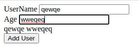

form that takes in name and age, 
has a button add user,
displays the user.

```javascript
  function handleSubmit (event) {
      alert("submitted")
    }
    return(
    <>
    <div>
      <label htmlFor="username"> UserName</label> {""}
      <input type="text" id ="username"/>
    </div>
    <div>
      <label htmlFor="age" > Age </label>
      <input type="text" id ="age"/>
    </div>
    <div>
      <button onClick = {handleSubmit}> Add User</button>

    </div>
    </>
  )
  }
  ```

  this needs to a form 
  tried adding onSubmit to button -- its not a form
  onclick shows alert

  need to display user and age

  mistakes
  value = "age
  value ={age} 
  onAnimalChange = {event => setAnimal(event.target.value)}


  ----

```javascript
  function App () {

    const [name,setName] = React.useState()
    const [age,setAge] = React.useState()

    function handleSubmit (event) {
      alert("submitted")
      setName(event.target.username.value)
      setAge(event.target.age.value)
    }
    return(
    <form>
    <div>
      <label htmlFor="username" > UserName</label> {""}
      <input type="text" id ="username" value = {name} onChange = {(event) => setName(event.target.value)}/>
    </div>
    <div>
      <label htmlFor="age" > Age </label>
      <input type="text" id ="age" value = {age} onChange = {() => setAge(event.target.value)}/>
      <div>{name} {age}</div>
    </div>
    <div>
      <button onClick = {handleSubmit}> Add User</button>

    </div>
    
    
    </form>
  )
  }
```
o/p of code is name in display dic populates as user types
  

  ---
```javascript
  function App () {

    const [username,setUsername] = React.useState()
    const [age,setAge] = React.useState()

    function handleSubmit (event) {
      event.preventDefault()
      //alert("submitted")
      console.log(event.target.username.value)
      console.log(event.target.age.value)
      setUsername(event.target.username.value)
      setAge(event.target.age.value)
      alert(`${username }`) 
    }
    return(
    <form onSubmit = {handleSubmit}>
    <div>
      <label htmlFor="username" > UserName</label> 
      <input type="text" id ="username" value = {username} />
    </div>
    <div>
      <label htmlFor="age" > Age </label>
      <input type="text" id ="age" value = {age} />
      
    </div>
    <div>
      <button type ="submit"> Add User</button>

    </div>
    
    
    </form>
  )
  }
     
  
  ReactDOM.render(<App/>, document.getElementById('root'))
  </script>
</body>```

some mistake 

mistake I was making was 
onChange = {() => setUsername(event.target.value)}