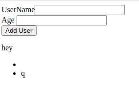

form that takes in name and age, 
has a button add user,
displays the user.

fetch data
validate the date
list State

working code

```javscript
  function App() {
      const [username, setUsername] = React.useState("");
      const [age, setAge] = React.useState("");
      const [usersList, setUsersList] = React.useState([]);

      function handleSubmit(event) {
        event.preventDefault();

        setUsersList((prevstate) => [
          ...prevstate,
          { username: username, age: age },
        ]);
        console.log("userlist", usersList);

        setUsername("");
        setAge("");
      }

      return (
        <>
          <form onSubmit={handleSubmit}>
            <div>
              <label htmlFor="username"> UserName</label>
              <input
                type="text"
                id="username"
                value={username}
                onChange={() => setUsername(event.target.value)}
              />
            </div>
            <div>
              <label htmlFor="age"> Age </label>
              <input
                type="text"
                id="age"
                value={age}
                onChange={() => setAge(event.target.value)}
              />
            </div>
            <div>
              <button type="submit"> Add User</button>
            </div>
          </form>
          <ul>
             {usersList.map (user => <li>{user.username}</li>)} 
          </ul> 
        </>
      );
    }```
---------
-----


```javascript
  function handleSubmit (event) {
      alert("submitted")
    }
    return(
    <>
    <div>
      <label htmlFor="username"> UserName</label> {""}
      <input type="text" id ="username"/>
    </div>
    <div>
      <label htmlFor="age" > Age </label>
      <input type="text" id ="age"/>
    </div>
    <div>
      <button onClick = {handleSubmit}> Add User</button>

    </div>
    </>
  )
  }
  ```

  this needs to a form 
  tried adding onSubmit to button -- its not a form
  onclick shows alert

  need to display user and age

  mistakes
  value = "age
  value ={age} 
  onChange = {event => set?(event.target.value)}


  ----

```javascript
  function App () {

    const [name,setName] = React.useState()
    const [age,setAge] = React.useState()

    function handleSubmit (event) {
      alert("submitted")
      setName(event.target.username.value)
      setAge(event.target.age.value)
    }
    return(
    <form>
    <div>
      <label htmlFor="username" > UserName</label> {""}
      <input type="text" id ="username" value = {name} onChange = {(event) => setName(event.target.value)}/>
    </div>
    <div>
      <label htmlFor="age" > Age </label>
      <input type="text" id ="age" value = {age} onChange = {() => setAge(event.target.value)}/>
      <div>{name} {age}</div>
    </div>
    <div>
      <button onClick = {handleSubmit}> Add User</button>

    </div>
    
    
    </form>
  )
  }
```
o/p of code is name in display dic populates as user types
  

  ---
```javascript
  function App () {

    const [username,setUsername] = React.useState()
    const [age,setAge] = React.useState()

    function handleSubmit (event) {
      event.preventDefault()
      //alert("submitted")
      console.log(event.target.username.value)
      console.log(event.target.age.value)
      setUsername(event.target.username.value)
      setAge(event.target.age.value)
      alert(`${username }`) 
    }
    return(
    <form onSubmit = {handleSubmit}>
    <div>
      <label htmlFor="username" > UserName</label> 
      <input type="text" id ="username" value = {username} />
    </div>
    <div>
      <label htmlFor="age" > Age </label>
      <input type="text" id ="age" value = {age} />
      
    </div>
    <div>
      <button type ="submit"> Add User</button>

    </div>
    
    
    </form>
  )
  }
     
  
  ReactDOM.render(<App/>, document.getElementById('root'))
  </script>
</body>```

some mistake 

mistake I was making was 
onChange = {() => setUsername(event.target.value)}


-------

adding value to input labels and setAge('') cleared the input after submit
imp-  feedback the current state(after empting) to  input


----


made array of object users

pushed every new input to it

rendered a list
BUT
the empty array is getting pushed too


``` javascript
const users = [
    {
      username : "",
      age: ""
    }
  ]

  function App () {

    const [username,setUsername] = React.useState('')
    const [age,setAge] = React.useState('')

    function handleSubmit (event) {
      console.log(users)
      event.preventDefault()
      //alert("submitted")
      users.push({username,age})
      console.log(users) // diff comp
      
      
      setUsername("")
      setAge("")
      
    }
    
    return(
      <>
    <form onSubmit = {handleSubmit}>
      <div>
      <label htmlFor="username" > UserName</label> 
      <input type="text" id ="username" value = {username} onChange = {() => setUsername(event.target.value)}  />
    </div>
    <div>
      <label htmlFor="age" > Age </label>
      <input type="text" id ="age" value = {age} onChange = {() => setAge(event.target.value)}   />
      
    </div>
    <div>
     
      <button type ="submit"> Add User</button>

    </div>
   
    
    </form>
    <p> {"hey"} </p> 
    <ul>
      {
        users.map((user) => ( 
          <li> {user.username} {user.age} years old </li>
         
        ))} 
      </ul>
    
    </>
  )
  }```


  ------------

DOESNT WORK 
  setUsersList( (preUsersList) => {
    return [...prevUsersList, {username:username, age: age}]
  })

  WORKS

  setUsersList(prevstate => ([...prevstate,{ username:username, age: age}]));

  -------
  strange:
  the console log just after the setState does not show the current state
  its bcs state is async

  ``` javascript
  function App() {
      const [username, setUsername] = React.useState("");
      const [age, setAge] = React.useState("");
      const [usersList, setUsersList] = React.useState([]);

      function handleSubmit(event) {
        event.preventDefault();

        setUsersList((prevstate) => [
          ...prevstate,
          { username: username, age: age },
        ]);
        console.log("userlist", usersList);

        setUsername("");
        setAge("");
      }

      return (
        <>
          <form onSubmit={handleSubmit}>
            <div>
              <label htmlFor="username"> UserName</label>
              <input
                type="text"
                id="username"
                value={username}
                onChange={() => setUsername(event.target.value)}
              />
            </div>
            <div>
              <label htmlFor="age"> Age </label>
              <input
                type="text"
                id="age"
                value={age}
                onChange={() => setAge(event.target.value)}
              />
            </div>
            <div>
              <button type="submit"> Add User</button>
            </div>
          </form>
          <p> {"hey"} </p>
        </>
      );
    }
```

------
mistake : 
<ul>
  <li> {usersList.map (user => <li> {user.username})} </li>
</ul>

v/s

<ul>
  {usersList.map (user => <li> {user.username}</li>)} 
</ul> 